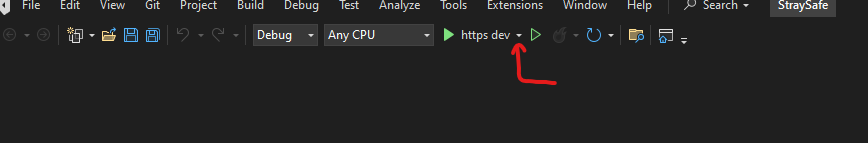
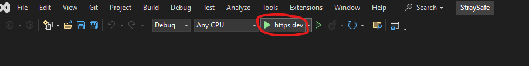

<h1 align="center">
  <br>
  
</h1>

<h3 align="center">C#/.NET 8 backend powering <span style="font-weight:bold;">straysafe</span> — a stray animal reporting platform.</h4>
<h4 align="center">(soon to be open-source!)</h4>

<div align="center">
  <a href="https://forthebadge.com">
    
  </a>
  <a href="https://forthebadge.com">
    
  </a>
  <a href="https://forthebadge.com">
    
  </a>
  <a href="https://forthebadge.com">
    
  </a>
</div>
<br/>
<p align="center">
  <a href="#features">features</a> •
  <a href="#getting-started">getting started</a> •
  <a href="#running">running</a> •
  <a href="#configuration">configuration</a> •
  <a href="#tech-stack">tech stack</a> •
  <a href="#project-structure">project structure</a> •
  <a href="#license">license</a>
</p>

---

## features

- RESTful ASP.NET Core Web API
- Supabase Auth integration, using JWT bearer tokens
- PostgreSQL database via EF Core
- Swagger/OpenAPI documentation

## getting started

prerequisites:

- [.NET 8 SDK](https://dotnet.microsoft.com/en-us/download)
- PostgreSQL database (Supabase or self-hosted)
- Supabase project for Auth (contact me for details!)

clone and run

```bash
# Clone the repo
git clone https://github.com/hassankgit/stray-safe-v1.git
cd stray-safe-v1

# Set up secrets
# please contact me to get access to user secrets :D locally, straysafe uses secrets.json
```

## running

### to debug API:

- ensure you're in the root directory of the repo in Visual Studio
- select the dropdown <span style="font-weight:bold;">(not the green arrow!)</span> and choose the `https dev` profile

  

- select the green arrow. The API should begin running in dev mode at <span style="font-weight:bold;"> https://localhost:7230 </span>

    

### to run API (usually for frontend testing)

- open a new terminal
- ensure you're in the root directory of the repo

```bash
cd StraySafe.Api
dotnet run --launch-profile "https dev"
```

- to exit, go back to the terminal and do `Ctrl + C`

#### the swagger is accessible at https://localhost:7230/swagger/index.html when api is running

## configuration

straysafe uses `secrets.json` (via `dotnet user-secrets`) for local development and [App Settings in Azure](https://learn.microsoft.com/en-us/azure/app-service/configure-common?tabs=portal#configure-app-settings) in production.<br/><br/>
if you would like to contribute to production, contact me for the `secrets.json` contents.<br/>
a dedicated dev environment has not been set up yet for the database, mostly because im broke and cant afford it.

| key                            | description                      |
| ------------------------------ | -------------------------------- |
| `Supabase:Url`                 | Supabase project URL             |
| `Supabase:ServiceRoleKey`      | Supabase service role key        |
| `Authentication:JwtSecret`     | Supabase JWT verification secret |
| `Authentication:ValidIssuer`   | Supabase Auth Issuer URL         |
| `Authentication:ValidAudience` | Supabase Valid Audience          |
| `ConnectionStrings:straySafe`  | PostgreSQL connection string     |

## tech stack

- ASP.NET Core Web API
- Entity Framework Core + PostgreSQL
- Supabase Auth (JWT)
- Azure App Service (for production deployment)

## project structure

```
stray-safe-v1/
|
├── StraySafe.Api/              # main API project
│   ├── Properties/
│       └── launchSettings.json # profiles for local dev
│   ├── Controllers/            # API endpoints
|   ├── appsettings.json
│   └── Program.cs/             # app configuration and startup
|
├── StraySafe.Data/             # handles data models and EF Core migrations
│   ├── Database/               # contains EF Core DbContext, DesignTimeDbContextFactory
│       └── Models/             # contains db models
│   ├── Migrations/             # EF Core migrations
│   ├── ManualMigrations/       # temporary manual SQL migrations to PostgreSQL db
|
├── StraySafe.Logic/            # handles business logic
│   ├── Admin/                  # admin-related logic
│   ├── Authentication/         # auth-related logic
│   └── ...
└── ...
```

## license

open source license coming soon!
